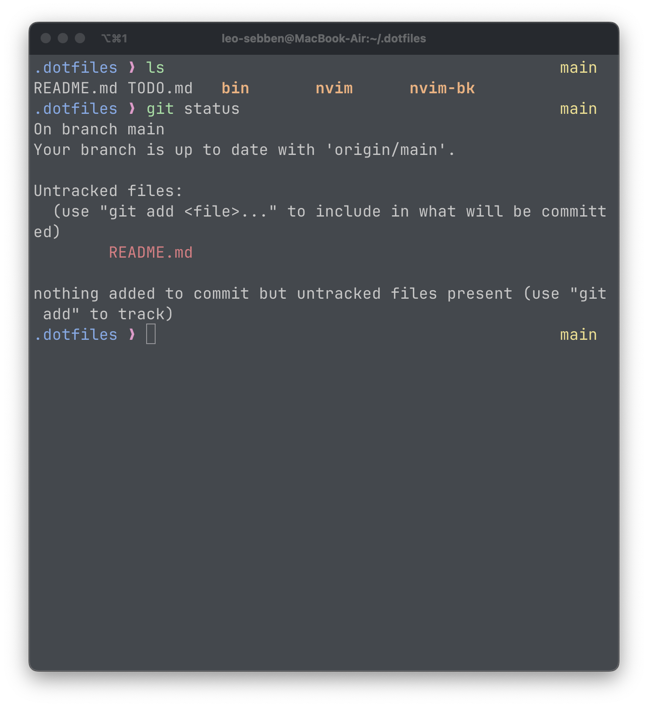

# Leosebben's dotfiles



## Description

This repository contains personalized configuration files for popular development tools such as NeoVim, Tmux, and Zsh. The configurations are tailored to complement the iTerm2 terminal emulator, which employs a custom color scheme that I made based on [common](https://github.com/jackharrisonsherlock/common).

## Installation

### Packer

```
git clone --depth 1 https://github.com/wbthomason/packer.nvim\ ~/.local/share/nvim/site/pack/packer/start/packer.nvim
```

### Dotfiles

```
git clone https://github.com/leosebben/.dotfiles.git ~/.dotfiles --depth 1
```

## Neovim Plugins

| Icon | Plugin | Description |
| --- | --- | --- |
| 📦 | **wbthomason/packer.nvim** | Lightweight plugin manager for Neovim. |
| 🌳 | **nvim-tree/nvim-tree.lua** | File explorer with a tree-like view of your project structure. |
| 🐍 | **neovim/nvim-lspconfig** | Collection of configurations for built-in LSP client in Neovim. |
| 🔧 | **williamboman/mason.nvim** | Configurable and extendable snippets plugin for Neovim. |
| 🔨 | **williamboman/mason-lspconfig.nvim** | LSP configuration for Mason snippets plugin. |
| 🔍 | **nvim-telescope/telescope.nvim** | Highly extensible fuzzy finder plugin for Neovim. |
| 🎨 | **nvim-treesitter/nvim-treesitter** | Advanced syntax highlighting and code folding using the Tree-sitter parsing library. |
| 🖥️ | **NvChad/nvterm** | Plugin for managing terminal buffers in Neovim. |
| 🎉 | **nvim-lualine/lualine.nvim** | Lightweight and customizable status line plugin. |
| 💬 | **tpope/vim-commentary** | Comment and uncomment lines efficiently. |
| 🚀 | **ThePrimeagen/harpoon** | Navigate through directories and files efficiently. |
| 🎁 | **tpope/vim-surround** | Easily add, change, and delete surroundings in pairs (such as quotes or parentheses). |
| 🌲 | **mbbill/undotree** | Visualize and navigate through undo history in Neovim. |
| 🎆 | **folke/tokyonight.nvim** | Beautiful and customizable colorscheme inspired by Tokyo's night life. |
| 🕵️ | **tpope/vim-fugitive** | Git integration and command wrapper for Neovim. |
| 📝 | **lewis6991/gitsigns.nvim** | Git decorations, such as signs and highlights, for Neovim. |
